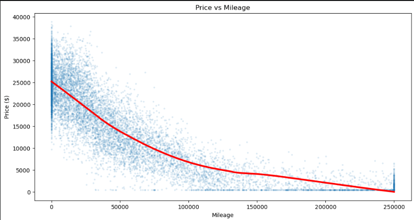

# 🚗 Used Car Price Analysis

## 📖 Project Overview

The **Used Car Price Analysis** project explores the factors that influence the resale value of used vehicles. Using Python and Exploratory Data Analysis (EDA), the dataset was cleaned, analyzed, and visualized to identify how features such as mileage, brand, transmission, fuel type, and sale trends impact used car prices. The project aims to provide meaningful insights into pricing patterns in the used car market.

---

## 📊 Featured Visualization

### Price vs Mileage

  

---

## ❓ Why I Chose This Graph

The **Price vs Mileage** regression plot is one of the most informative visualizations in the project because it clearly illustrates the relationship between a car's mileage and its market price. The fitted trend line highlights the overall decline in price as mileage increases, making it easy to understand how vehicle usage affects resale value. This graph effectively summarizes one of the most important factors influencing used car pricing.

---

## 🛠️ Tech Stack

- Python
- Pandas
- NumPy
- Matplotlib
- Seaborn
- Jupyter Notebook

---

## ✅ Conclusion

The analysis shows that **mileage is a major factor affecting used car prices**, with higher-mileage vehicles generally having lower resale values. Additional analyses on brand, transmission type, fuel type, and monthly sales trends provide a broader understanding of the used car market, demonstrating how data analysis can support informed pricing and purchasing decisions.
